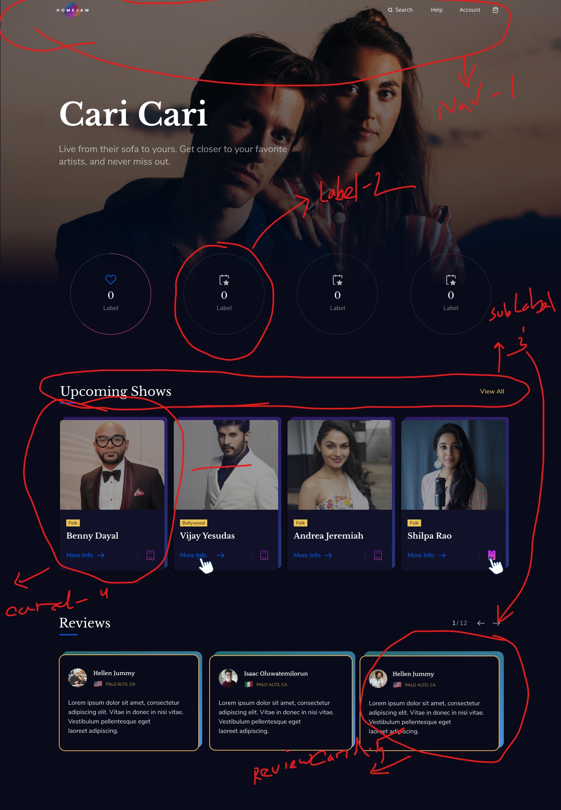
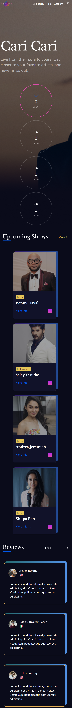

# homejam-job-task

I have made this full page for the assignment task given for an full time remote job opportunity. I have used html, tailwind, javascript, react.js Font-awesome, google-font is used for icons and fonts in this project. No other third-party library is used. I used fakeData to populate product details.

:round_pushpin: [LiveSite Link](https://homejam-job-task.web.app/ "CLICK ME")

### :point_down: Given jpg picture that need to turn into a (mobile-web) responsive functional landing page: 

### :point_down: Screenshot of my (web) responsive functional landing page:
 

### :point_down: Screenshot of my (mobile) responsive functional landing page:
 